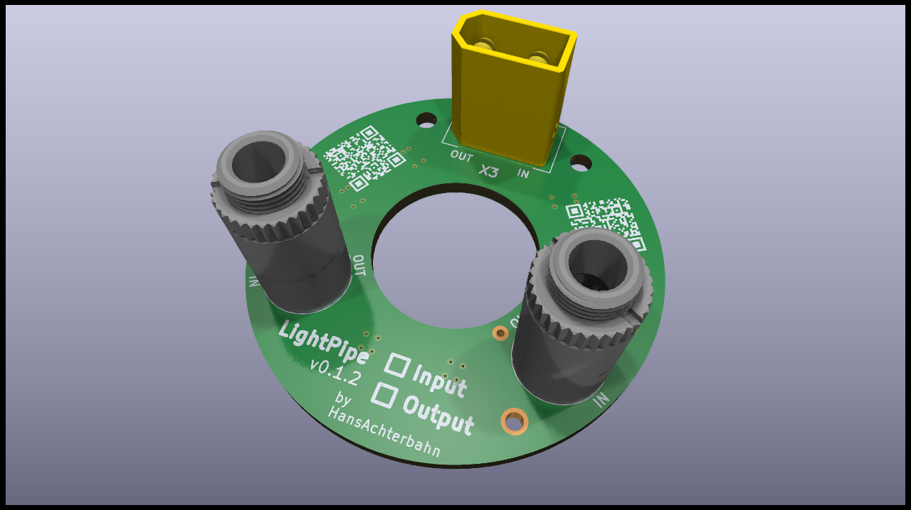
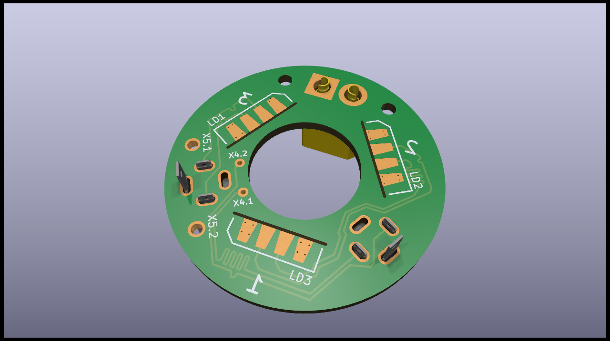
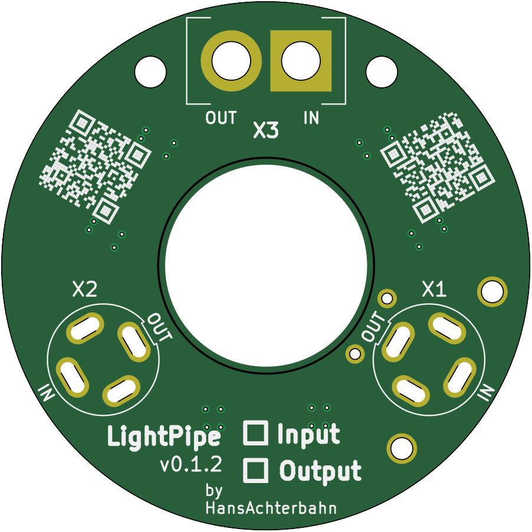
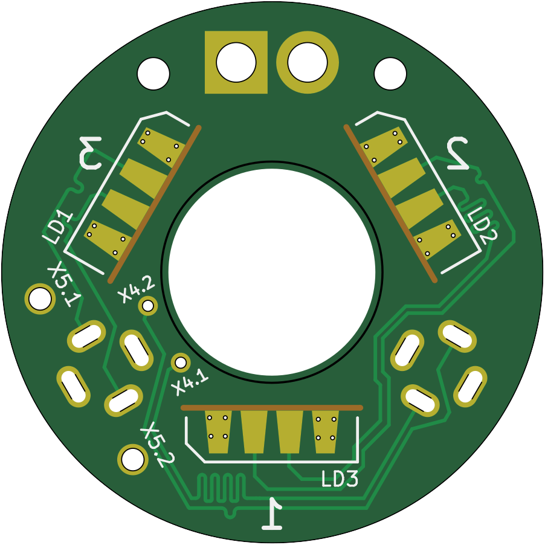

# LightPipe - Main PCB (Kicad)

LightPipes are colorful lighting pipes that can be combined to create complex and interesting geometries. The LightPipe project is based on the easily addressable APA102 RGB LEDs. Each LED in a LightPipe geometry can be addressed individually.

The LightPipe project uses the PCB in this project in a slightly modified form as input and output PCB. On the input side, it simply accepts data from a 3.5 jack and power from an XT30 connector. On the output side, the data is output to the next LightPipe via the same jack and power is supplied via the same XT30 connector.

An additional 3.5 female connector is used to tunnel the data from the output PCB back to the input PCB. With this arrangement it is possible to realize a complete tree structure and therefore to create arbitrary geometries.

In this repository you will find the schematics and board layouts created in KiCad. You will also find a 3D model of the PCB.

*Fork me and have fun!*

**LightPipe - First Prototyep @ Neotopia Hackspace in Göttingen**

## PCB 3D view

Animated 3D STL model: [kibot/3d/model](kibot/3d/model)

__Top view__

__Bottom view__

## Schematic

## Board

__Top view__

__Bottom view__

