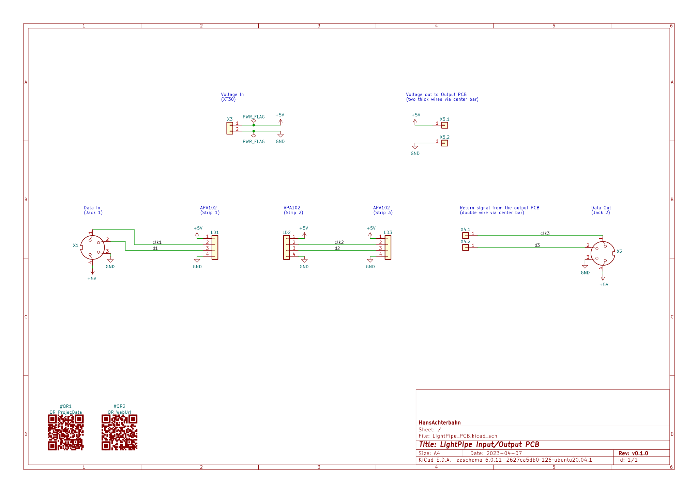
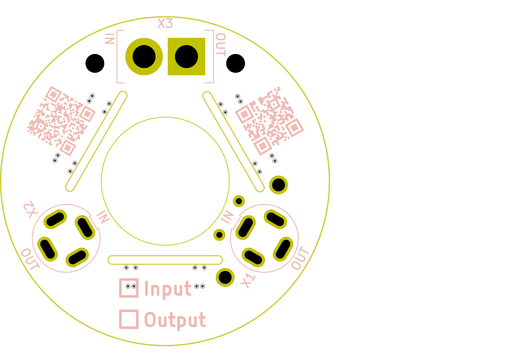
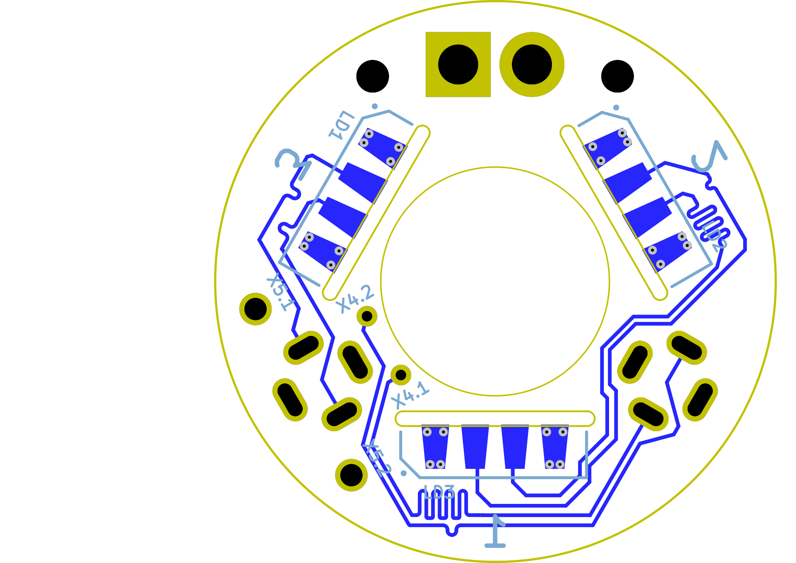

# PCB

Board size: 31.07x20.16 mm (1.22x0.79 inches)

- This is the size of the rectangle that contains the board
- Thickness: 1.6 mm (63 mils)
- Material: FR4
- Finish: None
- Layers: 4
- Copper thickness: 35 µm

Solder mask: TOP / BOTTOM

- Color: Green

Silk screen: TOP / BOTTOM

- Color: White

Stackup:

| Name                 | Type                 | Color    | Thickness | Material        | Epsilon_r | Loss tangent |
|----------------------|----------------------|----------|-----------|-----------------|-----------|--------------|
| F.SilkS              | Top Silk Screen      |          |           |                 |           |              |
| F.Paste              | Top Solder Paste     |          |           |                 |           |              |
| F.Mask               | Top Solder Mask      |          |        10 |                 |           |              |
| F.Cu                 | copper               |          |        35 |                 |           |              |
| dielectric 1         | core                 |          |       695 | FR4             |       4.5 |         0.02 |
| In1.Cu               | copper               |          |        35 |                 |           |              |
| dielectric 2         | prepreg              |          |        50 | FR4             |       4.5 |         0.02 |
| In2.Cu               | copper               |          |        35 |                 |           |              |
| dielectric 3         | core                 |          |       695 | FR4             |       4.5 |         0.02 |
| B.Cu                 | copper               |          |        35 |                 |           |              |
| B.Mask               | Bottom Solder Mask   |          |        10 |                 |           |              |
| B.Paste              | Bottom Solder Paste  |          |           |                 |           |              |
| B.SilkS              | Bottom Silk Screen   |          |           |                 |           |              |

# Important sizes

Clearance: 0.2 mm (8 mils)

Track width: 0.25 mm (10 mils)

- By design rules: 0.2 mm (8 mils)

Drill: 0.3 mm (12 mils)

- Vias: 0.3 mm (12 mils) [Design: 0.4 mm (16 mils)]
- Pads: 0.8 mm (31 mils)
- The above values are real drill sizes, they add 0.1 mm (4 mils) to plated holes (PTH)

Via: 0.6/0.2 mm (24/8 mils)

- By design rules: 0.4/0.3 mm (16/12 mils)
- Micro via: no [0.2/0.1 mm (8/4 mils)]
- Burried/blind via: no

Outer Annular Ring: 0.15 mm (6 mils)

- By design rules: 0.15 mm (6 mils)

Eurocircuits class: 4D

# General stats

Components count: (SMD/THT)

- Top: 0/3 (THT)
- Bottom: 3/4 (SMD + THT)

Defined tracks:

- 0.5 mm (20 mils)
- 0.75 mm (30 mils)
- 1.0 mm (39 mils)
- 1.5 mm (59 mils)
- 2.0 mm (79 mils)

Used tracks:

- 0.25 mm (10 mils) (115) defined: no

Defined vias:

- 0.6/0.2 mm (24/8 mils)

Used vias:

- 0.6/0.2 mm (24/8 mils) (Count: 24, Aspect: 2.7 A) defined: yes

Holes (excluding vias):

- 0.7 mm (28 mils) (2)
- 1.5 mm (59 mils) (2)
- 2.2 mm (87 mils) (2)
- 2.7 mm (106 mils) (2)

Oval holes:

- 1.0x2.2 mm (39x87 mils) (4)
- 1.0x2.4 mm (39x94 mils) (4)

Drill tools (including vias and computing adjusts and rounding):

- 0.3 mm (12 mils) (24)
- 0.8 mm (31 mils) (2)
- 1.1 mm (43 mils) (8)
- 1.6 mm (63 mils) (2)
- 2.2 mm (87 mils) (2)
- 2.8 mm (110 mils) (2)

# Schematic

{ width=16.5cm height=11.7cm }

# PCB Layers

{ width=16.5cm height=11.7cm }

{ width=16.5cm height=11.7cm }

